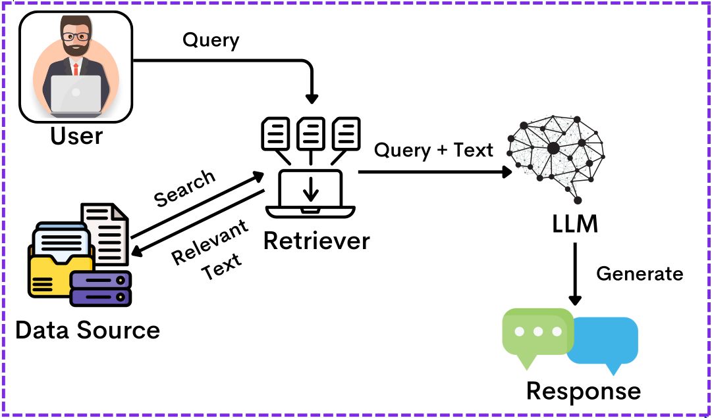
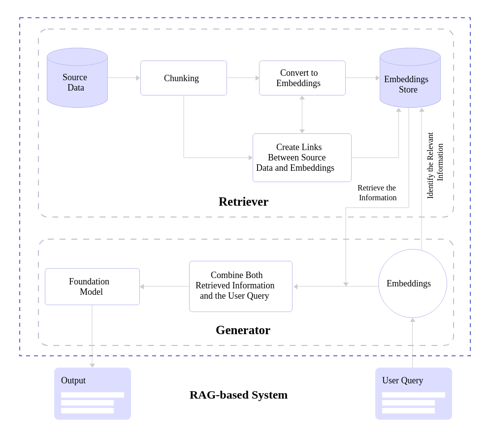
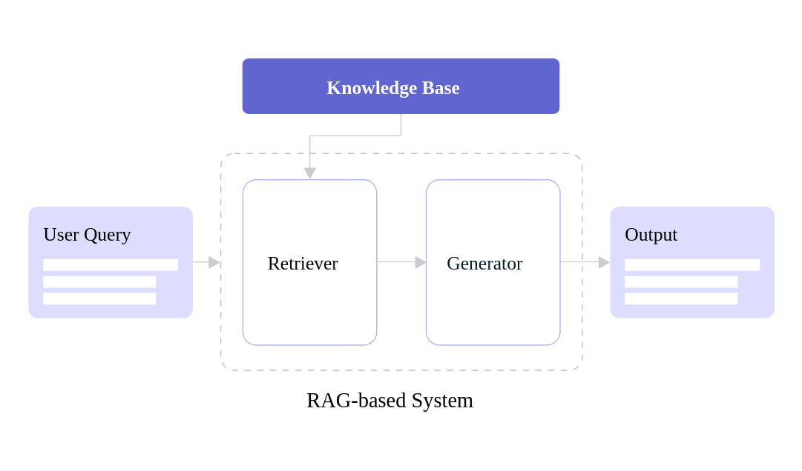

# Retrieval-Augmented Generation (RAG)

## 📌 Introduction
Retrieval-Augmented Generation (RAG) is a powerful framework that enhances the capabilities of large language models (LLMs) by incorporating external knowledge retrieval. 
Unlike traditional LLMs, which rely solely on pre-trained knowledge, RAG fetches relevant information from a knowledge source (such as databases or documents) to generate more accurate, context-aware, and up-to-date responses.



### Why Use RAG?
- ✅ **Overcomes Knowledge Cutoff**: Provides real-time and up-to-date information.
- ✅ **Improves Accuracy**: Reduces hallucinations by retrieving factual data.
- ✅ **Enhances Context Understanding**: Uses external knowledge to provide more detailed and specific responses.
- ✅ **Efficient Handling of Large Knowledge Bases**: Enables language models to access vast information without increasing model size.

---

## ⚙️ How RAG Works
RAG combines two key processes:

1. **Retrieval**: 
   - Queries an external knowledge base (e.g., vector database, search index) to fetch relevant documents.
   - Utilizes embeddings and similarity search to find contextually relevant data.

2. **Generation**:
   - Passes the retrieved information to a language model.
   - Generates responses based on both retrieved knowledge and internal model capabilities.



This enables the model to dynamically retrieve up-to-date facts and generate responses grounded in external knowledge.

---

## 🔩 Components of RAG

1. **Retriever**: Finds relevant documents from an external source.
2. **Generator**: Uses a language model (e.g., GPT, LLaMA) to generate responses based on retrieved data.
3. **Knowledge Base**: A structured or unstructured data repository (e.g., databases, document stores, vector databases).
4. **Embedding Model**: Converts text into vector representations for efficient search and retrieval.



### 🏆 Benefits of RAG
- 🚀 **Scalability**: Works with large datasets without needing extensive retraining.
- 🔍 **Fact-Based Responses**: Reduces the risk of misinformation.
- ⚡  **Adaptive Learning**: Can dynamically update its knowledge base without modifying the core model.
- 🌎 **Multidomain Applications**: Works for legal, medical, finance, and other industries.

---

## 🌍 Applications of RAG

- **Chatbots & Virtual Assistants**: Provide real-time, knowledge-enhanced responses.
- **Legal & Medical Research**: Retrieve domain-specific information for accurate case analysis.
- **Enterprise Search Systems**: Improve document retrieval and knowledge management.
- **Customer Support Automation**: Generate precise responses from company knowledge bases.
- **AI-Powered Code Assistance**: Enhance coding suggestions with updated programming documentation.

---

## ⚖️ RAG vs Traditional LLMs

| Feature           | Traditional LLMs | RAG |
|------------------|----------------|-----|
| Knowledge Scope  | Limited to training data | Accesses external sources |
| Up-to-date Info  | No (Static) | Yes (Dynamic) |
| Response Accuracy | May hallucinate facts | Fact-grounded responses |
| Scalability      | Requires retraining for updates | Updates knowledge dynamically |
| Resource Usage   | Heavy pre-training needed | Lighter model, relies on retrieval |

---

## 🚧 Challenges, Limitations, and Future of RAG

### 🔴 Challenges & Limitations
- **Latency Issues**: Retrieval step may slow down response time.
- **Dependency on Knowledge Base Quality**: Poor data leads to poor responses.
- **Security & Privacy Concerns**: Sensitive data exposure if not managed properly.
- **Complexity in Implementation**: Requires sophisticated retriever models and infrastructure.

### 🚀 Future of RAG
- 🔬 **Advancements in Retrieval Models**: Faster and more accurate search mechanisms.
- 🔄 **Hybrid RAG Models**: Combining different retrieval and generation strategies.
- 🌍 **Decentralized RAG Systems**: Privacy-preserving and federated learning-based retrieval systems.
- 🧠 **Integration with Multimodal AI**: Expanding RAG to work with images, videos, and other data formats.

---

## 📂 Repository Structure
```
rag-explained/
│── README.md                # Overview of RAG  
│── docs/                    
│   ├── 01-introduction.md    # Deep dive into RAG fundamentals  
│   ├── 02-how-it-works.md    # Detailed breakdown of retrieval & generation  
│   ├── 03-components.md      # In-depth look at retrievers, generators, embeddings  
│   ├── 04-applications.md    # Real-world use cases with examples  
│   ├── 05-comparison.md      # RAG vs Traditional LLMs - case studies  
│   ├── 06-challenges.md      # Technical challenges and possible solutions  
│   ├── 07-future.md          # Where RAG is heading  
│── code-examples/           
│   ├── simple_rag.py         # Basic RAG implementation  
│   ├── advanced_rag.ipynb    # Notebook with real-world examples  
│   ├── retriever.py          # Implementing a retriever from scratch  
│── datasets/                 # Sample datasets for testing retrieval  
│── references/               # Papers, blogs, and further learning resources  
│── CONTRIBUTING.md           # How others can contribute  
```

---

## 📚 Resources & Further Reading

- [Retrieval-Augmented Generation (Meta AI)](https://ai.facebook.com/blog/retrieval-augmented-generation-streamlining-the-creation-of-intelligent-natural-language-processing-models/)
- [Introduction to RAG by Hugging Face](https://huggingface.co/docs/transformers/en/model_doc/rag)
- [How to Build a RAG Pipeline (Pinecone)](https://www.pinecone.io/learn/retrieval-augmented-generation/)
- [Neural Retrieval Meets LLMs (Google DeepMind)](https://arxiv.org/abs/2005.11401)

---

💡 **Contributions are welcome!** If you have suggestions, feel free to submit a pull request. 🚀