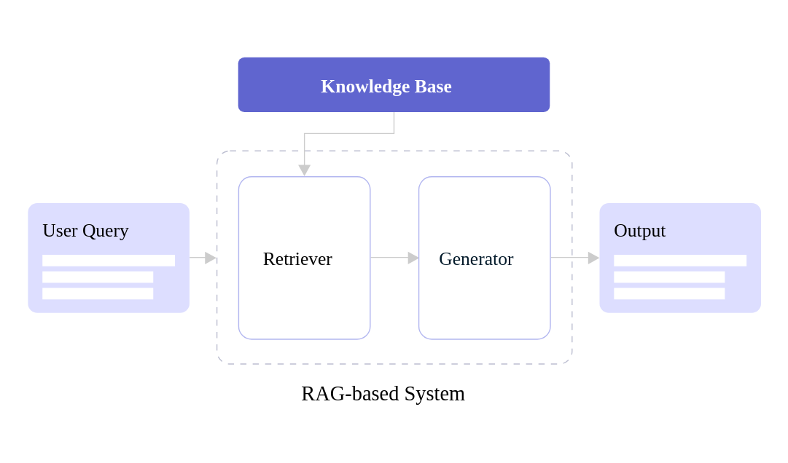

## 🔩 Components of RAG

1. **Retriever**: Finds relevant documents from an external source.
2. **Generator**: Uses a language model (e.g., GPT, LLaMA) to generate responses based on retrieved data.
3. **Knowledge Base**: A structured or unstructured data repository (e.g., databases, document stores, vector databases).
4. **Embedding Model**: Converts text into vector representations for efficient search and retrieval.

### 🏆 Benefits of RAG
- 🚀 **Scalability**: Works with large datasets without needing extensive retraining.
- 🔍 **Fact-Based Responses**: Reduces the risk of misinformation.
- ⚡  **Adaptive Learning**: Can dynamically update its knowledge base without modifying the core model.
- 🌎 **Multidomain Applications**: Works for legal, medical, finance, and other industries.
